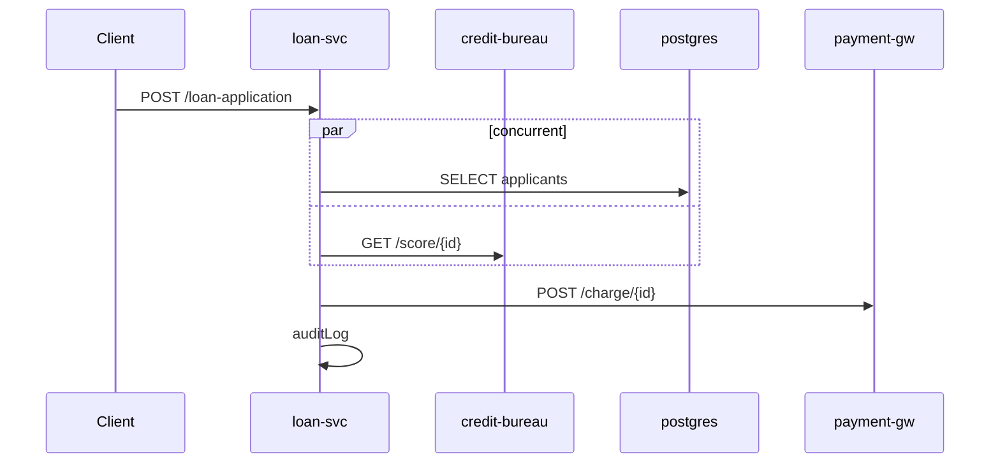

# Trace Canonicalization Transform — Specification

> **`ACTIVE`** · component specification (source of truth) · _reviewed 2026-06-13_

The transform that turns a raw OpenTelemetry trace (the observed output of one E2E flow) into a **deterministic, run-independent snapshot**. This snapshot is the golden file the test asserts against, and the source from which the human-readable sequence diagram is rendered. It is the load-bearing piece: if the transform is not perfectly deterministic across runs of the same flow under fixed data, the gate produces false diffs and erodes trust.

---

## 1. Determinism contract

The transform `C` must satisfy, for any two executions `r1`, `r2` of the same test against the same seeded data:

```
C(trace(r1)) == C(trace(r2))      // byte-identical canonical IR
```

It achieves this by **discarding every dimension that varies between runs** and recording only the flow's structural identity. The discards are explicit and part of the contract, so a reviewer knows exactly what the snapshot does and does not assert:

| Dimension | Treatment | Rationale |
|---|---|---|
| trace/span/parent IDs | dropped; linkage re-expressed as tree position | random per run |
| start/end times, durations | dropped (used transiently for ordering, then discarded) | volatile; not the thing being verified |
| host/IP/port/PID, SDK version, resource noise | dropped | environment-dependent |
| generated values in attributes (UUIDs, PKs, tokens, timestamps) | replaced with type placeholders (`<uuid>`, `<id>`) | volatile |
| raw URLs / SQL literals | parameterized to templates | volatile |
| error messages / stack traces | normalized to error *class* | volatile |
| observed interleaving of concurrent spans | replaced with canonical-key ordering + explicit `concurrent` flag | non-deterministic by definition |
| data-dependent repetition (loops) | collapsed to one representative + multiplicity class (configurable) | volume varies with test data |

What is **retained**: the operation tree, causal/sequential ordering, span kind, salience tier, status (ok/error), and a whitelisted set of salient, parameterized attributes. That set *is* the flow's identity.

---

## 2. Canonical data model

The IR is the golden file. Its shape encodes the hard decisions (ordering, concurrency, multiplicity) structurally rather than leaving them to render time.

```go
// CanonicalTrace is the deterministic representation of one exercised flow.
// Equality of two CanonicalTraces is the snapshot assertion.
type CanonicalTrace struct {
    Flow          string           // stable flow id (test name / triggering route)
    Service       string           // the self lifeline (emitted in §3.5; the renderer uses it)
    SchemaVersion string           // on-disk canonical form, "flowmap.trace/v1"; part of
                                   // snapshot equality, so a bump deliberately stales every
                                   // committed golden (coordinated regen, the golden-diff spec)
    Root          *CanonicalSpan   // normalized span tree
    Discards      DiscardManifest  // what was dropped, for transparency in review

    // Identity/provenance fields — carried alongside the structural snapshot, with
    // deliberately different equality treatment (see below and the golden-diff spec):
    Stamp      string // code-identity (deployed commit) of the captured code; behavioral
                      // mirror of the static graph's --stamp. Run-varying provenance.
    Provenance string // capture-fidelity grade (production|integration|synthetic),
                      // producer-set; the behavioral-impeachment audit's trust input.
}

type CanonicalSpan struct {
    Op        string            // derived canonical operation key (see §3.5)
    Kind      string            // server|client|internal|producer|consumer
    Peer      string            // counterparty lifeline (see §3.5); "" => self/internal
    Service   string            // owning service (OTel resource service.name); "" for an
                                // in-process single-service capture, set on a cross-service
                                // whole-flow capture so each op lands on its own lifeline
    Tier      int               // salience tier, assigned in §3.6 (1 = most consequential)
    Status    string            // ok|error|unset
    ErrorType string            // normalized error class; "" if none
    Async     bool              // reached across a broker via an OTLP span link (FOLLOWS_FROM),
                                // not a synchronous in-process call edge; omitted when false
    Attrs     map[string]string // secondary salient detail (keys sorted on serialize)
    Children  []ChildGroup      // ordered groups (see §3.3)
}

// ChildGroup makes ordering semantics explicit.
//   - Groups are emitted in happens-before order (sequential between groups).
//   - Within a group flagged Concurrent, member order is a race, so members are
//     stored in canonical-key order and the concurrency is surfaced, not hidden.
type ChildGroup struct {
    Concurrent   bool              // asserts parallelism (a race) between members
    Unordered    bool              // relative order could not be reliably established
                                   // (out-of-process siblings, or untimed) — distinct from
                                   // Concurrent: claims neither a sequence nor a race
    Multiplicity string            // "1" | "0..1" | "1..*" | exact e.g. "3"
    Members      []*CanonicalSpan  // canonical-key-sorted when Concurrent or order unreliable
}
```

Serialization is canonical JSON/YAML: keys sorted, no timestamps, stable tree (ordering already fixed by the transform). **The golden is the IR, not the Mermaid.** Mermaid is a deterministic *view* derived from the IR and committed alongside it for human review; keeping the assertion on the IR avoids Mermaid-renderer drift polluting the gate.

This is the **authoritative IR** shared across components. The renderer consumes `{Service, Op, Kind, Peer, Tier, Status, ErrorType, Children}`; the diff engine consumes `{Op, Kind, Peer, Tier, Status, ErrorType, Attrs, Children}`; `Discards` is review-transparency only. `Service` and `Peer` are derived during the canonical-key step (§3.5), so emitting them is free.

The identity/provenance fields get **three distinct equality treatments**, so snapshot equality rests on flow *behavior* alone (the golden-diff spec is the authority; summarized here because it shapes the IR contract):

- **`Stamp`** — neither written to the committed golden nor compared. It is run-varying provenance (the deployed commit); writing it would churn the golden every deploy. Identity is injected at audit time instead.
- **`Provenance`** — **written** into the committed golden (so the corpus self-describes its capture grade for the impeachment audit) but **excluded from equality**. Two captures of identical behavior at different grades (a harness "integration" re-drive vs a "production" deploy) must still assert equal — the grade is a trust input, not a behavioral dimension.
- **`Discards`** — excluded from equality; a review-only record of what was dropped.

(The behavioral-impeachment `corpusDigest` deliberately diverges from golden equality on `Provenance`: there the grade *is* folded in, because for the audit the grade is identity.)

---

## 3. The transform pipeline

An ordered sequence of passes. Each is a pure function of its input plus the (versioned) config.

### 3.1 Assembly & scoping
Reconstruct the span tree from `parent_span_id`. Select only the spans belonging to **this flow** via the correlation key (see §5) — never canonicalize a backend's entire trace store. Guard the edges: multiple roots or orphan spans (missing parent) indicate a scoping or completeness problem; attach orphans to a synthetic root and **flag**, do not silently drop.

> **Completeness / quiescence.** Spans arrive asynchronously and cross-service. You cannot canonicalize a trace you have not fully received. Wait for quiescence — root span ended *and* no new spans for a quiet interval — and assert a minimum expected span count. A truncated trace that snapshots "successfully" is the worst failure: a silent false golden. Fail loudly instead.

### 3.2 Identifier & temporal elimination
Remove trace/span/parent IDs. Remove start/end/duration from the persisted form — but only *after* §3.3 has used them. Apply the redaction policy: attribute keys and value patterns (UUID regex, numeric-id matchers) are replaced with type placeholders. Replace, don't drop, so "an id was here" stays visible without the volatile value.

### 3.3 Ordering & concurrency — the sharp edge
Sibling spans under a parent must be ordered deterministically, and concurrency must be represented honestly rather than frozen to one run's interleaving.

The rule:

1. **Between groups: happens-before order.** If sibling A reliably precedes sibling B, A's group comes first.
2. **Within a group: canonical-key order.** Provably-concurrent siblings are sorted by their canonical operation key (§3.5) and the group is flagged `Concurrent`.
3. **When ordering is not reliably known: treat as concurrent.** Determinism wins over fidelity-to-this-run — the snapshot represents the flow *class*, not a single execution.

The critical subtlety for a distributed system: **do not derive cross-service order from comparing timestamps across services.** Each service has its own clock; wall-clock skew makes cross-domain comparison unreliable. Instead:

- **Causal structure** (parent→child, span links) establishes happens-before across services for free — a child's subtree is caused by its parent.
- **Sibling order of downstream calls** is determined from the **caller's client spans**, which live in a *single* clock domain (the caller's process), not from the callee server spans in their separate domains. If a parent in service A issues client spans to B then C with non-overlapping intervals *in A's clock*, that is reliable sequential order; if they overlap in A's clock, they are concurrent.

This is what lets the same flow produce the same tree even though goroutines, async I/O, and independent service clocks guarantee the raw spans never arrive in a stable order.

### 3.4 Attribute projection & parameterization
**Allowlist, not denylist.** Keep only specified attribute keys (anchored to OTel semantic conventions: `http.request.method`, `http.route`, `db.system`, `db.operation`, `rpc.method`, `messaging.operation`, etc.). Everything else is dropped, so a new volatile attribute from an instrumentation upgrade cannot silently leak into the golden.

Parameterize the values that survive:
- **URLs → route templates**: `/loans/{id}`, not `/loans/8412`. Prefer an existing `http.route`/`url.template` attribute; fall back to segment parameterization (numeric/UUID segments → `{param}`).
- **SQL → normalized form**: strip literals, normalize whitespace, parameterize values — `WHERE id = ?`, not `WHERE id = 8412`. Pragmatic version: literal-stripping regex. Robust version: a real SQL normalizer. Given the DB-centric verification (CloudBeaver), `db.statement` spans will be common and raw SQL is highly volatile — invest here.

### 3.5 Canonical operation key (naming)
Do not trust raw span names — instrumentations encode IDs into them (`SELECT loans WHERE id=8412`) and naming varies across libraries and versions. **Derive** a canonical key from `kind` + salient attributes: `HTTP POST /loans/{id}`, `DB sqlite SELECT loans`, `RPC LedgerService/PostEntry`. This decouples the snapshot from instrumentation naming quirks and is what `Op` holds.

The same step emits `Peer` (the counterparty lifeline — `Bus` for producer/consumer, the `db.system`/`peer.service` for outbound, `""` for internal) and, once per trace, `Service` (the self lifeline). Both fall out of the attributes already inspected to build `Op`, so they cost nothing extra.

### 3.6 Tier assignment
Derive the span's normalized features from semantic conventions (span kind → boundary; `messaging.operation` / `db.operation` / HTTP method → effect; status → fallible; the canonical `Op` → identity) and call the shared tier-map classifier to set `Tier`. This runs *after* attribute projection (so the features exist) and *before* salience filtering (which consumes `Tier`). It is the same classifier the static extractor uses, so a logging call is tier 4 and a publish tier 1 whether seen here or statically.

### 3.7 Structural normalization
- **Loop collapse.** Data-dependent repetition (N identical subtrees) collapses to one representative with a `Multiplicity` class (`1..*`), so processing 3 vs. 300 items yields the same snapshot. Configurable to exact-count where N is fixed and meaningful.
- **Salience filtering.** Using the `Tier` assigned in §3.6, drop spans above the configured threshold (default `tier ≤ warn`, omitting tier 3/4) and promote survivors. The same classifier drives the static artifact too — one intent encoding, two consumers.
  - **Keep-tagged-waypoint exception (L1 localization).** A sub-threshold internal span is *also* kept when it carries a non-empty `flowmap.fqn` localization tag (`capture.FQNTagKey`): it is a first-party **waypoint** the behavioral-impeachment severance walk anchors on (impeachment plan §7), so dropping it would erase the very signal it exists to carry. The keep predicate is `tier ≤ threshold || Attrs[FQNTagKey] != ""`. It is scoped to **non-empty** tags — an empty tag (the producer's fail-closed ⊥ when no first-party opener was found) does *not* keep the span — and only the in-process harness producer sets the tag, so post-hoc/production (untagged) ingestion contracts compute exactly as before. The kept tag survives attribute projection verbatim (the severance walk reconciles that runtime spelling to an ssa node). The keep is deterministic: the tag is a pure function of the call path, and the kept span's ordering/collapse already ran upstream, so the snapshot stays byte-identical across runs.
- **Retries.** Preserve by default (a retry is behaviorally real) but flag error-then-success patterns; allow normalization of *known-transient* retries via config. Lean toward preserving and letting review judge.
- **Errors.** Retain `Status`; normalize `ErrorType` to the exception class, dropping message/stacktrace. An errored flow is a *different* flow identity than a successful one — the success-path test and the failure-path test are separate flows with separate goldens, which is correct.

### 3.8 Serialization
Emit canonical IR (sorted keys, fixed tree). Then render Mermaid from the IR as a committed view. Both are deterministic functions of the normalized tree.

---

## 4. Configuration surface

The policies are config, versioned and CODEOWNERS-owned — this file is itself a lightweight, auditable encoding of intent.

| Knob | Purpose | Suggested default |
|---|---|---|
| `attributeAllowlist` | which span attrs define flow identity | OTel semconv core set |
| `redaction` | keys + value patterns → placeholders | UUID, numeric-id, timestamp matchers |
| `urlTemplating` / `sqlNormalization` | value parameterization rules | route attr if present, else segment-param; SQL literal-strip |
| `salienceTier` | minimum tier retained in the snapshot | `warn` (tiers 1–2) |
| `multiplicity` | collapse loops vs. assert exact count, per-op | collapse |
| `retryHandling` | preserve / normalize transient | preserve + flag |
| `quiescence` | quiet interval + min span count | 2s / per-flow expected count |

---

## 5. Correlation & guards

- **Correlation.** Playwright triggers; OTel captures server-side. Inject a `traceparent` header (W3C trace context) or a test-correlation attribute from the trigger so the trace for *this* step is fetchable and scopeable to nothing else. Without it you have backend spans you cannot reliably attribute to the test.
- **Determinism self-test (do not skip).** In CI, run the canonicalizer twice on the same trace — and ideally run the test 2–3× and canonicalize each — and assert the canonical outputs are identical **before** comparing to the golden. If they differ, the transform or the test data is not yet deterministic, and you have caught it as a config bug rather than as golden churn. This is the single most valuable operational safeguard.
- **Missing correlation / truncated trace** → hard failure, never a snapshot.

---

## 6. Pipeline placement & gate wiring

```
Playwright trigger (traceparent injected)
        │
        ▼
System under test  ──spans──►  OTel Collector (test pipeline, AlwaysSample)
        │                              │
        │                              ▼
        │                        trace store / exporter
        ▼                              │
wait for quiescence ◄──────────────────┘
        │
        ▼
fetch trace by correlation key
        │
        ▼
CANONICALIZE  ──►  determinism self-test  ──►  canonical IR
        │
        ├──► compare to golden  (or `-update` to re-baseline, Go golden convention)
        │         │
        │         ├─ differs, no update in PR  → FAIL CI  (unintended behavioral change)
        │         └─ differs, golden updated   → CODEOWNERS routes the Mermaid diff to you
        │
        └──► render Mermaid (committed view)
```

Both the golden IR and the rendered Mermaid live on CODEOWNERS-owned paths, so a behavioral change is unbypassable: changing the flow changes the IR, which routes the diagram diff to a human who judges "is this the behavior I expect?"

> **Topology note.** The diagram above shows the *post-hoc, out-of-process* capture mode — Playwright against a running service, fetched from a collector — which is the path for E2E and, later, nightly inter-service runs. The **v1 per-MR path is in-process**: the service runs inside the test with an in-memory exporter, so there is no collector, store, or fetch step, and enforcement is author-regenerated with CI as the staleness backstop rather than a CI-run pipeline (see harness §1 and the scope & guarantees doc). Canonicalization onward is identical for both.

---

## 7. Worked example (abbreviated)

**Raw trace** (one run of `POST /loan-application`, volatile bits in **bold**):

```
span SERVER  name="POST /loan-application"  trace_id=**7f3a…**  start=**12:00:01.412**  http.route="/loan-application"
  span INTERNAL name="evaluateApplication"  start=**…**
    span CLIENT name="GET creditbureau **/score/8412**"  peer.service="credit-bureau"  start=**t1**
    span CLIENT name="SELECT **applicants WHERE id=8412**"  db.system="postgresql"  start=**t2**
  span CLIENT  name="POST payments **/charge/req_9f2**"  peer.service="payment-gw"  status=OK
  span INTERNAL name="auditLog"  start=**…**
```

(creditbureau and the DB read are issued concurrently by `evaluateApplication`, determined from that caller's client-span intervals.)

**Canonical IR:**

```yaml
flow: POST /loan-application
root:
  op: "HTTP POST /loan-application"
  kind: server
  tier: 1
  status: ok
  children:
    - members:                      # sequential group
        - op: "evaluateApplication"
          kind: internal
          tier: 3
          children:
            - concurrent: true      # race-ordered → canonical-key sort
              members:
                - op: "DB postgresql SELECT applicants"
                  kind: client
                  tier: 2
                  attrs: { db.statement: "SELECT … WHERE id = ?" }
                - op: "HTTP GET credit-bureau /score/{id}"
                  kind: client
                  tier: 1
    - members:
        - op: "HTTP POST payment-gw /charge/{id}"
          kind: client
          tier: 1
          status: ok
    - members:
        - op: "auditLog"
          kind: internal
          tier: 1
```

**Mermaid view** (rendered from the IR):



Run it again with a different applicant id, different timing, different goroutine interleaving — the IR and the diagram are identical.

---

## 8. Resolved decisions

All four prior open decisions are now settled:

1. **Tier threshold for the committed snapshot** → `warn` (tiers 1–2) by default, with per-flow widening to `info` for compliance-critical flows.
2. **Multiplicity vs. exact count** → default collapse to `1..*`; tight cardinality (`1`, `0..1`, exact-N) is a per-op opt-in declared per-flow and applied to financial/compliance invariants. The prescriptive assertion is enforced at test time against the IR's observed multiplicity (see golden + diff spec).
3. **SQL normalization depth** → lexer/tokenizer-based (collapses `IN`-lists and multi-row inserts), with the canonical `Op` keyed on `db.operation` + table so structural identity barely depends on it.
4. **Where canonicalization runs** → resolved by the capture harness: capture mode follows test process topology — in-process in-memory exporter for Go integration tests, post-hoc collector fetch for out-of-process Playwright E2E and multi-service flows.
