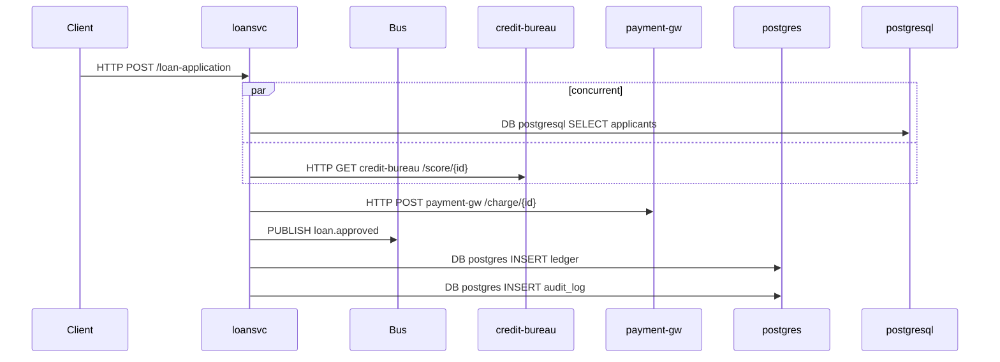

```mermaid
sequenceDiagram
    participant Client as Client
    participant loansvc as loansvc
    participant Bus as Bus
    participant credit_bureau as credit-bureau
    participant payment_gw as payment-gw
    participant postgres as postgres
    participant postgresql as postgresql
    Client->>loansvc: HTTP POST /loan-application
    par concurrent
        loansvc->>postgresql: DB postgresql SELECT applicants
    and
        loansvc->>credit_bureau: HTTP GET credit-bureau /score/{id}
    end
    loansvc->>payment_gw: HTTP POST payment-gw /charge/{id}
    loansvc->>Bus: PUBLISH loan.approved
    loansvc->>postgres: DB postgres INSERT ledger
    loansvc->>postgres: DB postgres INSERT audit_log
```
