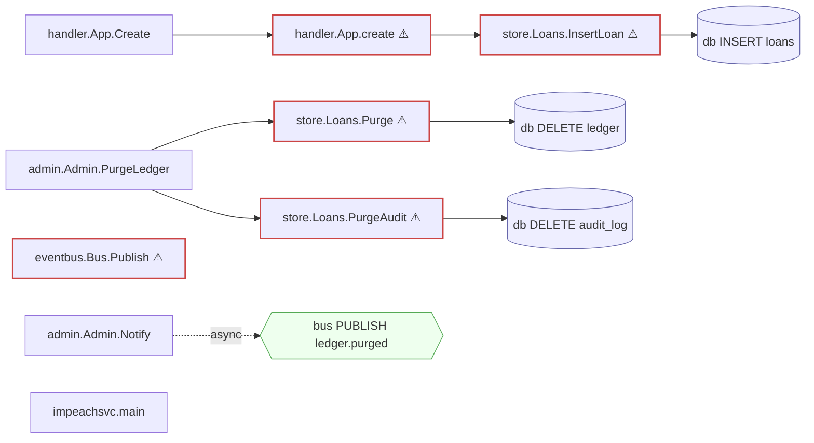

```mermaid
flowchart LR
    %% static call graph — scope: whole graph; algo: rta
    %% 17 first-party nodes above tier 2 hidden as plumbing; pass --show-plumbing to include
    admin_Admin_Notify["admin.Admin.Notify"]
    admin_Admin_PurgeLedger["admin.Admin.PurgeLedger"]
    eventbus_Bus_Publish["eventbus.Bus.Publish ⚠"]:::fallible
    handler_App_Create["handler.App.Create"]
    handler_App_create["handler.App.create ⚠"]:::fallible
    store_Loans_InsertLoan["store.Loans.InsertLoan ⚠"]:::fallible
    store_Loans_Purge["store.Loans.Purge ⚠"]:::fallible
    store_Loans_PurgeAudit["store.Loans.PurgeAudit ⚠"]:::fallible
    impeachsvc_main["impeachsvc.main"]
    bus_bus_PUBLISH_ledger_purged{{"bus PUBLISH ledger.purged"}}:::bus
    db_db_INSERT_loans[("db INSERT loans")]:::db
    db_db_DELETE_ledger[("db DELETE ledger")]:::db
    db_db_DELETE_audit_log[("db DELETE audit_log")]:::db
    admin_Admin_Notify -. async .-> bus_bus_PUBLISH_ledger_purged
    admin_Admin_PurgeLedger --> store_Loans_Purge
    admin_Admin_PurgeLedger --> store_Loans_PurgeAudit
    handler_App_Create --> handler_App_create
    handler_App_create --> store_Loans_InsertLoan
    store_Loans_InsertLoan --> db_db_INSERT_loans
    store_Loans_Purge --> db_db_DELETE_ledger
    store_Loans_PurgeAudit --> db_db_DELETE_audit_log
    classDef fallible stroke:#c44,stroke-width:2px
    classDef db fill:#eef,stroke:#66a
    classDef bus fill:#efe,stroke:#5a5
    classDef external fill:#fef6e8,stroke:#c93
    classDef blind fill:#fde,stroke:#c33,stroke-dasharray:3 3
```
