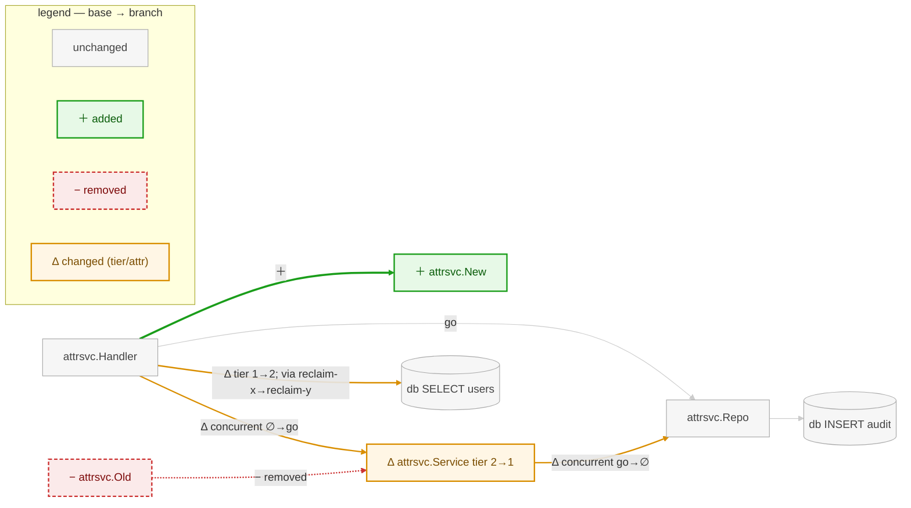

```mermaid
flowchart LR
    %% call-graph diff — base → branch (a view, never a gate)
    subgraph legend["legend — base → branch"]
        direction LR
        lg_kept["unchanged"]:::kept
        lg_added["＋ added"]:::added
        lg_removed["− removed"]:::removed
        lg_changed["Δ changed (tier/attr)"]:::changed
    end
    attrsvc_Handler["attrsvc.Handler"]:::kept
    attrsvc_New["＋ attrsvc.New"]:::added
    attrsvc_Old["− attrsvc.Old"]:::removed
    attrsvc_Repo["attrsvc.Repo"]:::kept
    attrsvc_Service["Δ attrsvc.Service tier 2→1"]:::changed
    db_db_SELECT_users[("db SELECT users")]:::kept
    db_db_INSERT_audit[("db INSERT audit")]:::kept
    attrsvc_Handler -->|Δ tier 1→2; via reclaim-x→reclaim-y| db_db_SELECT_users
    attrsvc_Handler ==>|＋| attrsvc_New
    attrsvc_Handler -->|go| attrsvc_Repo
    attrsvc_Handler -->|Δ concurrent ∅→go| attrsvc_Service
    attrsvc_Old -.->|− removed| attrsvc_Service
    attrsvc_Repo --> db_db_INSERT_audit
    attrsvc_Service -->|Δ concurrent go→∅| attrsvc_Repo
    linkStyle 1 stroke:#1a9d1a,stroke-width:3px
    linkStyle 4 stroke:#cc3333,stroke-width:2px
    linkStyle 2,5 stroke:#cccccc
    linkStyle 0,3,6 stroke:#d98e00,stroke-width:2px
    classDef kept fill:#f6f6f6,stroke:#aaaaaa,color:#444444
    classDef added fill:#e7f9e7,stroke:#1a9d1a,stroke-width:2px,color:#0a5d0a
    classDef removed fill:#fbeaea,stroke:#cc3333,stroke-width:2px,stroke-dasharray:5 3,color:#7d0a0a
    classDef changed fill:#fff6e5,stroke:#d98e00,stroke-width:2px,color:#7a4d00
```
