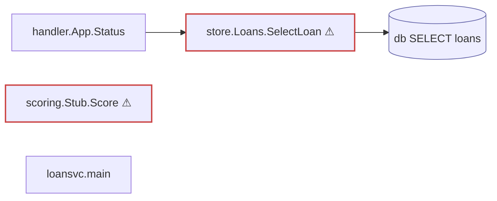

```mermaid
flowchart LR
    %% static call graph — scope: focus: (*example.com/loansvc/internal/handler.App).Status, store.Loans).SelectLoan, boundary:db SELECT loans, example.com/loansvc.main, /Stub\).Score$/, boundary:db UPDATE loans; algo: rta
    %% 1 blind spot outside the focus set shown only in the whole-graph view
    %% 3 frontier markers outside the focus set shown only in the whole-graph view
    %% 1 focus name(s) resolve only to boundary endpoints with no induced edge — not drawn: boundary:db UPDATE loans
    handler_App_Status["handler.App.Status"]
    scoring_Stub_Score["scoring.Stub.Score ⚠"]:::fallible
    store_Loans_SelectLoan["store.Loans.SelectLoan ⚠"]:::fallible
    loansvc_main["loansvc.main"]
    db_db_SELECT_loans[("db SELECT loans")]:::db
    handler_App_Status --> store_Loans_SelectLoan
    store_Loans_SelectLoan --> db_db_SELECT_loans
    classDef fallible stroke:#c44,stroke-width:2px
    classDef db fill:#eef,stroke:#66a
    classDef bus fill:#efe,stroke:#5a5
    classDef external fill:#fef6e8,stroke:#c93
    classDef blind fill:#fde,stroke:#c33,stroke-dasharray:3 3
```
