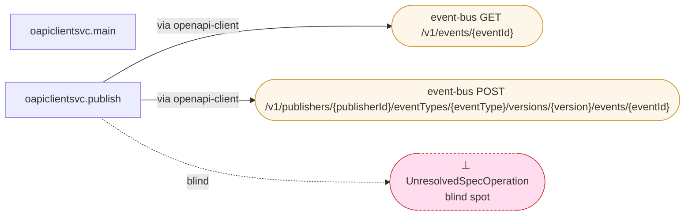

```mermaid
flowchart LR
    %% static call graph — scope: whole graph; algo: rta
    %% 8 first-party nodes above tier 2 hidden as plumbing; pass --show-plumbing to include
    oapiclientsvc_main["oapiclientsvc.main"]
    oapiclientsvc_publish["oapiclientsvc.publish"]
    external_event_bus_GET__v1_events__eventId_(["event-bus GET /v1/events/{eventId}"]):::external
    external_event_bus_POST__v1_publishers__publisherId__eventTypes__eventType__versions__version__events__eventId_(["event-bus POST /v1/publishers/{publisherId}/eventTypes/{eventType}/versions/{version}/events/{eventId}"]):::external
    blind_UnresolvedSpecOperation(["⊥ UnresolvedSpecOperation<br/>blind spot"]):::blind
    oapiclientsvc_publish -->|via openapi-client| external_event_bus_GET__v1_events__eventId_
    oapiclientsvc_publish -->|via openapi-client| external_event_bus_POST__v1_publishers__publisherId__eventTypes__eventType__versions__version__events__eventId_
    oapiclientsvc_publish -. blind .-> blind_UnresolvedSpecOperation
    classDef fallible stroke:#c44,stroke-width:2px
    classDef db fill:#eef,stroke:#66a
    classDef bus fill:#efe,stroke:#5a5
    classDef external fill:#fef6e8,stroke:#c93
    classDef blind fill:#fde,stroke:#c33,stroke-dasharray:3 3
```
