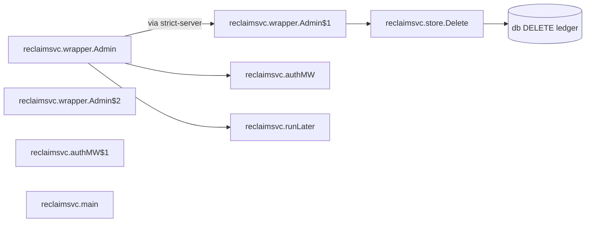

```mermaid
flowchart LR
    %% static call graph — scope: whole graph; algo: rta
    reclaimsvc_store_Delete["reclaimsvc.store.Delete"]
    reclaimsvc_wrapper_Admin["reclaimsvc.wrapper.Admin"]
    reclaimsvc_wrapper_Admin_1["reclaimsvc.wrapper.Admin$1"]
    reclaimsvc_wrapper_Admin_2["reclaimsvc.wrapper.Admin$2"]
    reclaimsvc_authMW["reclaimsvc.authMW"]
    reclaimsvc_authMW_1["reclaimsvc.authMW$1"]
    reclaimsvc_main["reclaimsvc.main"]
    reclaimsvc_runLater["reclaimsvc.runLater"]
    db_db_DELETE_ledger[("db DELETE ledger")]:::db
    reclaimsvc_store_Delete --> db_db_DELETE_ledger
    reclaimsvc_wrapper_Admin -->|via strict-server| reclaimsvc_wrapper_Admin_1
    reclaimsvc_wrapper_Admin --> reclaimsvc_authMW
    reclaimsvc_wrapper_Admin --> reclaimsvc_runLater
    reclaimsvc_wrapper_Admin_1 --> reclaimsvc_store_Delete
    classDef fallible stroke:#c44,stroke-width:2px
    classDef db fill:#eef,stroke:#66a
    classDef bus fill:#efe,stroke:#5a5
    classDef external fill:#fef6e8,stroke:#c93
    classDef blind fill:#fde,stroke:#c33,stroke-dasharray:3 3
```
