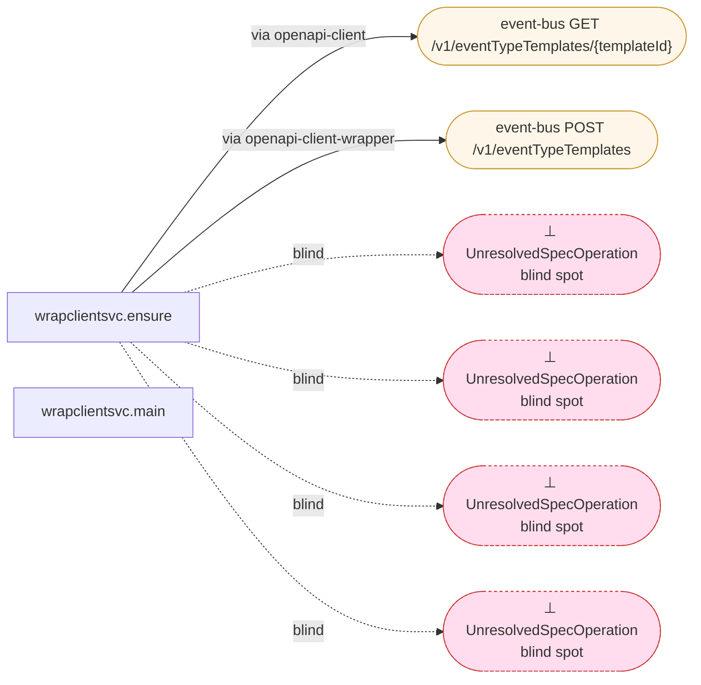

```mermaid
flowchart LR
    %% static call graph — scope: whole graph; algo: rta
    wrapclientsvc_ensure["wrapclientsvc.ensure"]
    wrapclientsvc_main["wrapclientsvc.main"]
    external_event_bus_GET__v1_eventTypeTemplates__templateId_(["event-bus GET /v1/eventTypeTemplates/{templateId}"]):::external
    external_event_bus_POST__v1_eventTypeTemplates(["event-bus POST /v1/eventTypeTemplates"]):::external
    blind_UnresolvedSpecOperation(["⊥ UnresolvedSpecOperation<br/>blind spot"]):::blind
    blind_UnresolvedSpecOperation1(["⊥ UnresolvedSpecOperation<br/>blind spot"]):::blind
    blind_UnresolvedSpecOperation2(["⊥ UnresolvedSpecOperation<br/>blind spot"]):::blind
    blind_UnresolvedSpecOperation3(["⊥ UnresolvedSpecOperation<br/>blind spot"]):::blind
    wrapclientsvc_ensure -->|via openapi-client| external_event_bus_GET__v1_eventTypeTemplates__templateId_
    wrapclientsvc_ensure -->|via openapi-client-wrapper| external_event_bus_POST__v1_eventTypeTemplates
    wrapclientsvc_ensure -. blind .-> blind_UnresolvedSpecOperation
    wrapclientsvc_ensure -. blind .-> blind_UnresolvedSpecOperation1
    wrapclientsvc_ensure -. blind .-> blind_UnresolvedSpecOperation2
    wrapclientsvc_ensure -. blind .-> blind_UnresolvedSpecOperation3
    classDef fallible stroke:#c44,stroke-width:2px
    classDef db fill:#eef,stroke:#66a
    classDef bus fill:#efe,stroke:#5a5
    classDef external fill:#fef6e8,stroke:#c93
    classDef blind fill:#fde,stroke:#c33,stroke-dasharray:3 3
```
