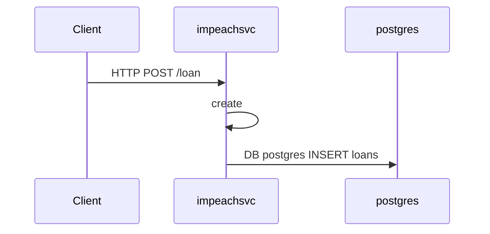

```mermaid
sequenceDiagram
    participant Client as Client
    participant impeachsvc as impeachsvc
    participant postgres as postgres
    Client->>impeachsvc: HTTP POST /loan
    impeachsvc->>impeachsvc: create
    impeachsvc->>postgres: DB postgres INSERT loans
```
