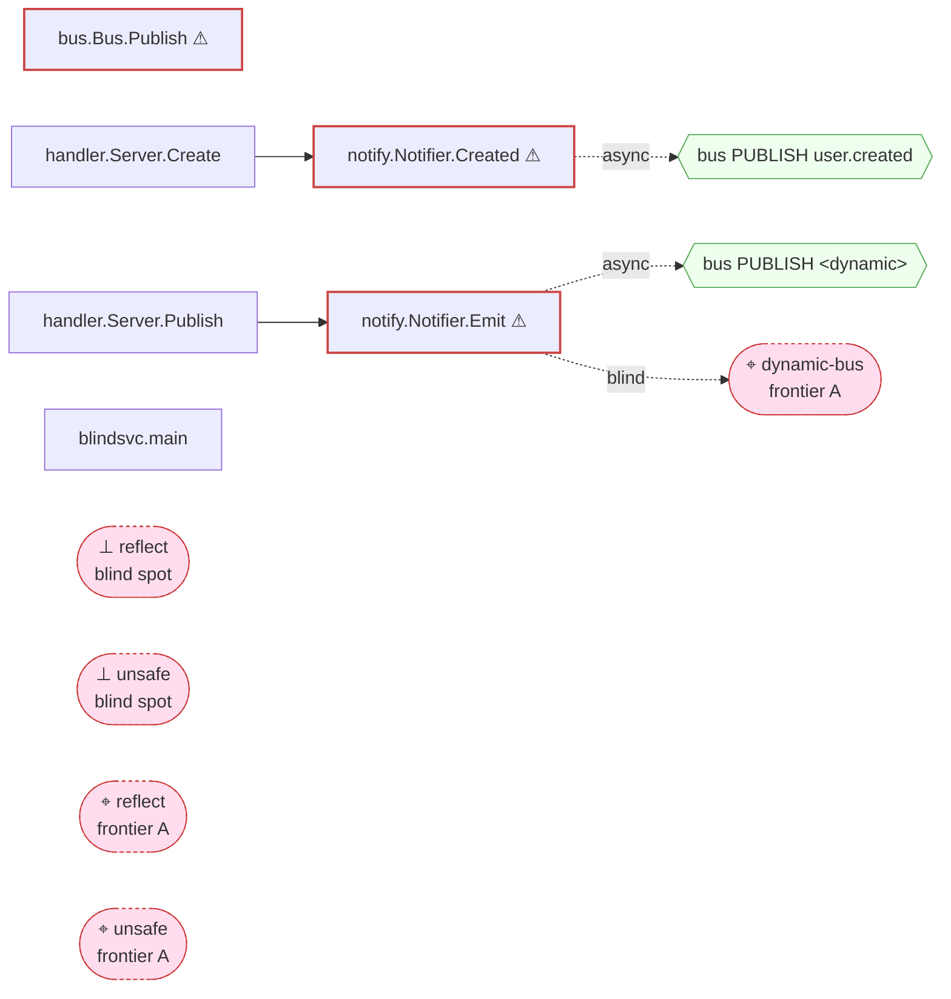

```mermaid
flowchart LR
    %% static call graph — scope: whole graph; algo: rta
    %% 5 first-party nodes above tier 2 hidden as plumbing; pass --show-plumbing to include
    bus_Bus_Publish["bus.Bus.Publish ⚠"]:::fallible
    handler_Server_Create["handler.Server.Create"]
    handler_Server_Publish["handler.Server.Publish"]
    notify_Notifier_Created["notify.Notifier.Created ⚠"]:::fallible
    notify_Notifier_Emit["notify.Notifier.Emit ⚠"]:::fallible
    blindsvc_main["blindsvc.main"]
    bus_bus_PUBLISH_user_created{{"bus PUBLISH user.created"}}:::bus
    bus_bus_PUBLISH__dynamic_{{"bus PUBLISH &lt;dynamic&gt;"}}:::bus
    blind_reflect(["⊥ reflect<br/>blind spot"]):::blind
    blind_unsafe(["⊥ unsafe<br/>blind spot"]):::blind
    frontier_dynamic_bus(["⌖ dynamic-bus<br/>frontier A"]):::blind
    frontier_reflect(["⌖ reflect<br/>frontier A"]):::blind
    frontier_unsafe(["⌖ unsafe<br/>frontier A"]):::blind
    handler_Server_Create --> notify_Notifier_Created
    handler_Server_Publish --> notify_Notifier_Emit
    notify_Notifier_Created -. async .-> bus_bus_PUBLISH_user_created
    notify_Notifier_Emit -. async .-> bus_bus_PUBLISH__dynamic_
    notify_Notifier_Emit -. blind .-> frontier_dynamic_bus
    classDef fallible stroke:#c44,stroke-width:2px
    classDef db fill:#eef,stroke:#66a
    classDef bus fill:#efe,stroke:#5a5
    classDef external fill:#fef6e8,stroke:#c93
    classDef blind fill:#fde,stroke:#c33,stroke-dasharray:3 3
```
