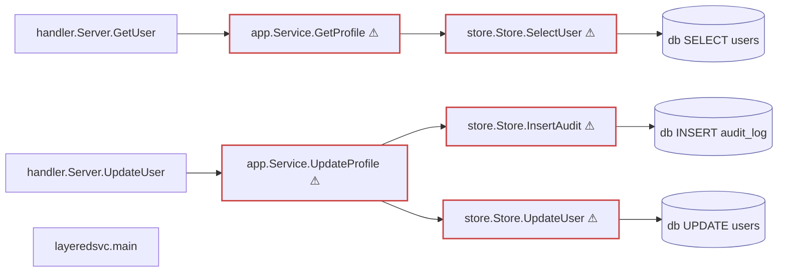

```mermaid
flowchart LR
    %% static call graph — scope: whole graph; algo: rta
    %% 5 first-party nodes above tier 2 hidden as plumbing; pass --show-plumbing to include
    app_Service_GetProfile["app.Service.GetProfile ⚠"]:::fallible
    app_Service_UpdateProfile["app.Service.UpdateProfile ⚠"]:::fallible
    handler_Server_GetUser["handler.Server.GetUser"]
    handler_Server_UpdateUser["handler.Server.UpdateUser"]
    store_Store_InsertAudit["store.Store.InsertAudit ⚠"]:::fallible
    store_Store_SelectUser["store.Store.SelectUser ⚠"]:::fallible
    store_Store_UpdateUser["store.Store.UpdateUser ⚠"]:::fallible
    layeredsvc_main["layeredsvc.main"]
    db_db_INSERT_audit_log[("db INSERT audit_log")]:::db
    db_db_SELECT_users[("db SELECT users")]:::db
    db_db_UPDATE_users[("db UPDATE users")]:::db
    app_Service_GetProfile --> store_Store_SelectUser
    app_Service_UpdateProfile --> store_Store_InsertAudit
    app_Service_UpdateProfile --> store_Store_UpdateUser
    handler_Server_GetUser --> app_Service_GetProfile
    handler_Server_UpdateUser --> app_Service_UpdateProfile
    store_Store_InsertAudit --> db_db_INSERT_audit_log
    store_Store_SelectUser --> db_db_SELECT_users
    store_Store_UpdateUser --> db_db_UPDATE_users
    classDef fallible stroke:#c44,stroke-width:2px
    classDef db fill:#eef,stroke:#66a
    classDef bus fill:#efe,stroke:#5a5
    classDef external fill:#fef6e8,stroke:#c93
    classDef blind fill:#fde,stroke:#c33,stroke-dasharray:3 3
```
