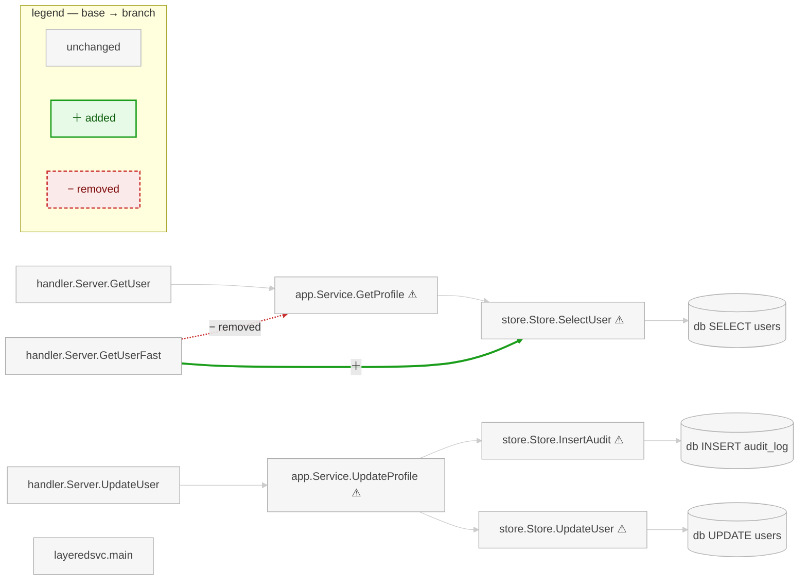

```mermaid
flowchart LR
    %% call-graph diff — base → branch (a view, never a gate)
    %% 5 unchanged nodes above tier 2 hidden; changed nodes are always shown
    subgraph legend["legend — base → branch"]
        direction LR
        lg_kept["unchanged"]:::kept
        lg_added["＋ added"]:::added
        lg_removed["− removed"]:::removed
    end
    app_Service_GetProfile["app.Service.GetProfile ⚠"]:::kept
    app_Service_UpdateProfile["app.Service.UpdateProfile ⚠"]:::kept
    handler_Server_GetUser["handler.Server.GetUser"]:::kept
    handler_Server_GetUserFast["handler.Server.GetUserFast"]:::kept
    handler_Server_UpdateUser["handler.Server.UpdateUser"]:::kept
    store_Store_InsertAudit["store.Store.InsertAudit ⚠"]:::kept
    store_Store_SelectUser["store.Store.SelectUser ⚠"]:::kept
    store_Store_UpdateUser["store.Store.UpdateUser ⚠"]:::kept
    layeredsvc_main["layeredsvc.main"]:::kept
    db_db_INSERT_audit_log[("db INSERT audit_log")]:::kept
    db_db_SELECT_users[("db SELECT users")]:::kept
    db_db_UPDATE_users[("db UPDATE users")]:::kept
    app_Service_GetProfile --> store_Store_SelectUser
    app_Service_UpdateProfile --> store_Store_InsertAudit
    app_Service_UpdateProfile --> store_Store_UpdateUser
    handler_Server_GetUser --> app_Service_GetProfile
    handler_Server_GetUserFast -.->|− removed| app_Service_GetProfile
    handler_Server_GetUserFast ==>|＋| store_Store_SelectUser
    handler_Server_UpdateUser --> app_Service_UpdateProfile
    store_Store_InsertAudit --> db_db_INSERT_audit_log
    store_Store_SelectUser --> db_db_SELECT_users
    store_Store_UpdateUser --> db_db_UPDATE_users
    linkStyle 5 stroke:#1a9d1a,stroke-width:3px
    linkStyle 4 stroke:#cc3333,stroke-width:2px
    linkStyle 0,1,2,3,6,7,8,9 stroke:#cccccc
    classDef kept fill:#f6f6f6,stroke:#aaaaaa,color:#444444
    classDef added fill:#e7f9e7,stroke:#1a9d1a,stroke-width:2px,color:#0a5d0a
    classDef removed fill:#fbeaea,stroke:#cc3333,stroke-width:2px,stroke-dasharray:5 3,color:#7d0a0a
```
