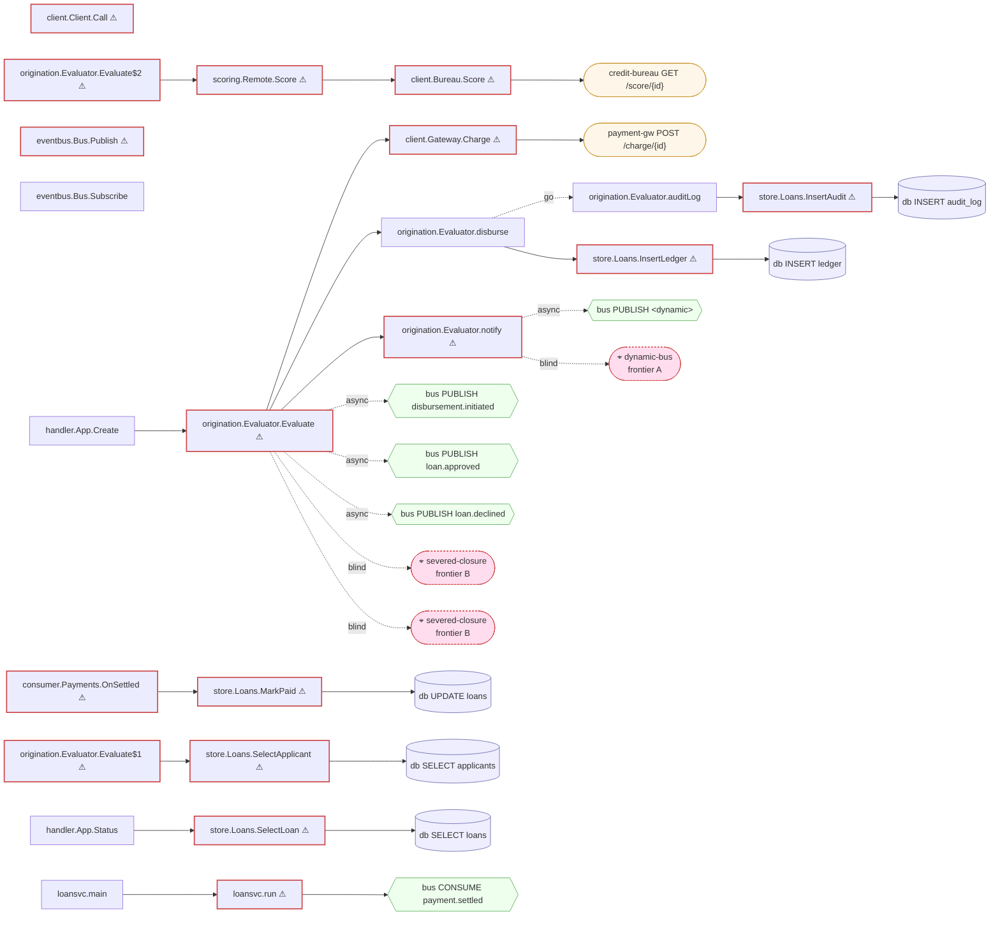

```mermaid
flowchart LR
    %% static call graph — scope: whole graph; algo: rta
    %% 17 first-party nodes above tier 2 hidden as plumbing; pass --show-plumbing to include
    client_Bureau_Score["client.Bureau.Score ⚠"]:::fallible
    client_Client_Call["client.Client.Call ⚠"]:::fallible
    client_Gateway_Charge["client.Gateway.Charge ⚠"]:::fallible
    consumer_Payments_OnSettled["consumer.Payments.OnSettled ⚠"]:::fallible
    eventbus_Bus_Publish["eventbus.Bus.Publish ⚠"]:::fallible
    eventbus_Bus_Subscribe["eventbus.Bus.Subscribe"]
    handler_App_Create["handler.App.Create"]
    handler_App_Status["handler.App.Status"]
    origination_Evaluator_Evaluate["origination.Evaluator.Evaluate ⚠"]:::fallible
    origination_Evaluator_Evaluate_1["origination.Evaluator.Evaluate$1 ⚠"]:::fallible
    origination_Evaluator_Evaluate_2["origination.Evaluator.Evaluate$2 ⚠"]:::fallible
    origination_Evaluator_auditLog["origination.Evaluator.auditLog"]
    origination_Evaluator_disburse["origination.Evaluator.disburse"]
    origination_Evaluator_notify["origination.Evaluator.notify ⚠"]:::fallible
    scoring_Remote_Score["scoring.Remote.Score ⚠"]:::fallible
    store_Loans_InsertAudit["store.Loans.InsertAudit ⚠"]:::fallible
    store_Loans_InsertLedger["store.Loans.InsertLedger ⚠"]:::fallible
    store_Loans_MarkPaid["store.Loans.MarkPaid ⚠"]:::fallible
    store_Loans_SelectApplicant["store.Loans.SelectApplicant ⚠"]:::fallible
    store_Loans_SelectLoan["store.Loans.SelectLoan ⚠"]:::fallible
    loansvc_main["loansvc.main"]
    loansvc_run["loansvc.run ⚠"]:::fallible
    external_credit_bureau_GET__score__id_(["credit-bureau GET /score/{id}"]):::external
    external_payment_gw_POST__charge__id_(["payment-gw POST /charge/{id}"]):::external
    bus_bus_PUBLISH_disbursement_initiated{{"bus PUBLISH disbursement.initiated"}}:::bus
    bus_bus_PUBLISH_loan_approved{{"bus PUBLISH loan.approved"}}:::bus
    bus_bus_PUBLISH_loan_declined{{"bus PUBLISH loan.declined"}}:::bus
    bus_bus_PUBLISH__dynamic_{{"bus PUBLISH &lt;dynamic&gt;"}}:::bus
    db_db_INSERT_audit_log[("db INSERT audit_log")]:::db
    db_db_INSERT_ledger[("db INSERT ledger")]:::db
    db_db_UPDATE_loans[("db UPDATE loans")]:::db
    db_db_SELECT_applicants[("db SELECT applicants")]:::db
    db_db_SELECT_loans[("db SELECT loans")]:::db
    bus_bus_CONSUME_payment_settled{{"bus CONSUME payment.settled"}}:::bus
    frontier_dynamic_bus(["⌖ dynamic-bus<br/>frontier A"]):::blind
    frontier_severed_closure(["⌖ severed-closure<br/>frontier B"]):::blind
    frontier_severed_closure1(["⌖ severed-closure<br/>frontier B"]):::blind
    client_Bureau_Score --> external_credit_bureau_GET__score__id_
    client_Gateway_Charge --> external_payment_gw_POST__charge__id_
    consumer_Payments_OnSettled --> store_Loans_MarkPaid
    handler_App_Create --> origination_Evaluator_Evaluate
    handler_App_Status --> store_Loans_SelectLoan
    origination_Evaluator_Evaluate --> client_Gateway_Charge
    origination_Evaluator_Evaluate --> origination_Evaluator_disburse
    origination_Evaluator_Evaluate --> origination_Evaluator_notify
    origination_Evaluator_Evaluate -. async .-> bus_bus_PUBLISH_disbursement_initiated
    origination_Evaluator_Evaluate -. async .-> bus_bus_PUBLISH_loan_approved
    origination_Evaluator_Evaluate -. async .-> bus_bus_PUBLISH_loan_declined
    origination_Evaluator_Evaluate_1 --> store_Loans_SelectApplicant
    origination_Evaluator_Evaluate_2 --> scoring_Remote_Score
    origination_Evaluator_auditLog --> store_Loans_InsertAudit
    origination_Evaluator_disburse -. go .-> origination_Evaluator_auditLog
    origination_Evaluator_disburse --> store_Loans_InsertLedger
    origination_Evaluator_notify -. async .-> bus_bus_PUBLISH__dynamic_
    scoring_Remote_Score --> client_Bureau_Score
    store_Loans_InsertAudit --> db_db_INSERT_audit_log
    store_Loans_InsertLedger --> db_db_INSERT_ledger
    store_Loans_MarkPaid --> db_db_UPDATE_loans
    store_Loans_SelectApplicant --> db_db_SELECT_applicants
    store_Loans_SelectLoan --> db_db_SELECT_loans
    loansvc_main --> loansvc_run
    loansvc_run --> bus_bus_CONSUME_payment_settled
    origination_Evaluator_notify -. blind .-> frontier_dynamic_bus
    origination_Evaluator_Evaluate -. blind .-> frontier_severed_closure
    origination_Evaluator_Evaluate -. blind .-> frontier_severed_closure1
    classDef fallible stroke:#c44,stroke-width:2px
    classDef db fill:#eef,stroke:#66a
    classDef bus fill:#efe,stroke:#5a5
    classDef external fill:#fef6e8,stroke:#c93
    classDef blind fill:#fde,stroke:#c33,stroke-dasharray:3 3
```
