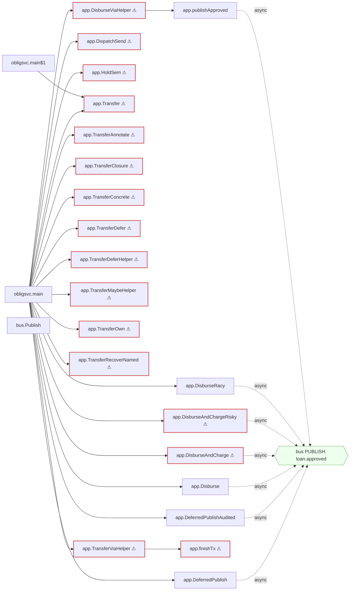

```mermaid
flowchart LR
    %% static call graph — scope: whole graph; algo: rta
    %% 25 first-party nodes above tier 2 hidden as plumbing; pass --show-plumbing to include
    obligsvc_main["obligsvc.main"]
    obligsvc_main_1["obligsvc.main$1"]
    app_DeferredPublish["app.DeferredPublish"]
    app_DeferredPublishAudited["app.DeferredPublishAudited"]
    app_Disburse["app.Disburse"]
    app_DisburseAndCharge["app.DisburseAndCharge ⚠"]:::fallible
    app_DisburseAndChargeRisky["app.DisburseAndChargeRisky ⚠"]:::fallible
    app_DisburseRacy["app.DisburseRacy"]
    app_DisburseViaHelper["app.DisburseViaHelper ⚠"]:::fallible
    app_DispatchSend["app.DispatchSend ⚠"]:::fallible
    app_HoldSem["app.HoldSem ⚠"]:::fallible
    app_Transfer["app.Transfer ⚠"]:::fallible
    app_TransferAnnotate["app.TransferAnnotate ⚠"]:::fallible
    app_TransferClosure["app.TransferClosure ⚠"]:::fallible
    app_TransferConcrete["app.TransferConcrete ⚠"]:::fallible
    app_TransferDefer["app.TransferDefer ⚠"]:::fallible
    app_TransferDeferHelper["app.TransferDeferHelper ⚠"]:::fallible
    app_TransferMaybeHelper["app.TransferMaybeHelper ⚠"]:::fallible
    app_TransferOwn["app.TransferOwn ⚠"]:::fallible
    app_TransferRecoverNamed["app.TransferRecoverNamed ⚠"]:::fallible
    app_TransferViaHelper["app.TransferViaHelper ⚠"]:::fallible
    app_finishTx["app.finishTx ⚠"]:::fallible
    app_publishApproved["app.publishApproved"]
    bus_Publish["bus.Publish"]
    bus_bus_PUBLISH_loan_approved{{"bus PUBLISH loan.approved"}}:::bus
    obligsvc_main --> app_DeferredPublish
    obligsvc_main --> app_DeferredPublishAudited
    obligsvc_main --> app_Disburse
    obligsvc_main --> app_DisburseAndCharge
    obligsvc_main --> app_DisburseAndChargeRisky
    obligsvc_main --> app_DisburseRacy
    obligsvc_main --> app_DisburseViaHelper
    obligsvc_main --> app_DispatchSend
    obligsvc_main --> app_HoldSem
    obligsvc_main --> app_Transfer
    obligsvc_main --> app_TransferAnnotate
    obligsvc_main --> app_TransferClosure
    obligsvc_main --> app_TransferConcrete
    obligsvc_main --> app_TransferDefer
    obligsvc_main --> app_TransferDeferHelper
    obligsvc_main --> app_TransferMaybeHelper
    obligsvc_main --> app_TransferOwn
    obligsvc_main --> app_TransferRecoverNamed
    obligsvc_main --> app_TransferViaHelper
    obligsvc_main_1 --> app_Transfer
    app_DeferredPublish -. async .-> bus_bus_PUBLISH_loan_approved
    app_DeferredPublishAudited -. async .-> bus_bus_PUBLISH_loan_approved
    app_Disburse -. async .-> bus_bus_PUBLISH_loan_approved
    app_DisburseAndCharge -. async .-> bus_bus_PUBLISH_loan_approved
    app_DisburseAndChargeRisky -. async .-> bus_bus_PUBLISH_loan_approved
    app_DisburseRacy -. async .-> bus_bus_PUBLISH_loan_approved
    app_DisburseViaHelper --> app_publishApproved
    app_TransferViaHelper --> app_finishTx
    app_publishApproved -. async .-> bus_bus_PUBLISH_loan_approved
    classDef fallible stroke:#c44,stroke-width:2px
    classDef db fill:#eef,stroke:#66a
    classDef bus fill:#efe,stroke:#5a5
    classDef external fill:#fef6e8,stroke:#c93
    classDef blind fill:#fde,stroke:#c33,stroke-dasharray:3 3
```
